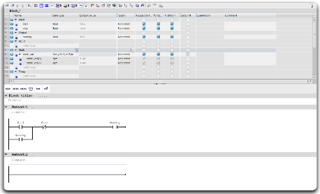

# Table Editor 项目规格说明

## 参考资源

## Why
实现一个简化版的变量表编辑器，类似于西门子TIA Portal中的变量表功能，支持对变量的添加、删除、修改和查看操作，提供数据验证功能。

## What Changes
- 创建基于React + TypeScript的表格编辑器应用
- 实现表格显示、行操作、单元格编辑功能
- 实现数据验证逻辑（名称唯一性、数据类型、默认值格式）
- 支持BOOL和INT两种数据类型
- 提供清晰的项目结构和文档
- 使用Less作为CSS预处理器
- 页面占满一屏，表格内部滚动（基于ResizeObserver动态计算高度）

## Impact
- 创建新的前端应用项目
- 需要选择合适的表格组件库、CSS框架和状态管理方案
- 需要实现完整的用户交互和数据验证逻辑

## 实际技术栈
| 类别 | 技术选型 | 实际版本 |
|------|---------|---------|
| 构建工具 | Vite | ^8.1.0 |
| UI框架 | React | ^19.2.7 |
| 语言 | TypeScript | ~6.0.2 |
| 表格/UI组件 | Ant Design (antd) | ^6.5.0 |
| 图标 | @ant-design/icons | ^6.3.2 |
| 状态管理 | Zustand | ^5.0.14 |
| CSS预处理 | Less | ^4.6.7 |
| 测试 | Vitest + Testing Library | ^4.1.9 |

## ADDED Requirements

### Requirement: 表格显示功能
系统应当提供一个变量表编辑器界面，包含以下列：Index、Name、Data Type、Default Value、Comment。

#### Scenario: 初始加载空表格
- **WHEN** 用户打开变量表编辑器页面
- **THEN** 显示一个空表格，包含Index、Name、Data Type、Default Value、Comment列
- **AND** Index列只读且自动生成
- **AND** 显示"Add Row"和"Delete Row"按钮
- **AND** 页面占满一屏高度，表格区域内部滚动

### Requirement: 添加变量行
系统应当支持用户添加新的变量行到表格中。

#### Scenario: 添加新行
- **WHEN** 用户点击"Add Row"按钮
- **THEN** 在表格末尾添加一个新行
- **AND** 新行的所有字段（name, data type, default value, comment）默认为空
- **AND** Index自动生成为当前最大index + 1

### Requirement: 删除变量行
系统应当支持用户删除选中的变量行。

#### Scenario: 删除选中行
- **WHEN** 用户选中一行并点击"Delete Row"按钮
- **THEN** 该行从表格中删除
- **AND** 后续行的Index自动重新计算

### Requirement: 编辑变量名称
系统应当支持用户编辑变量名称，并提供验证功能。

#### Scenario: 名称验证 - 空值
- **WHEN** 用户输入空名称
- **THEN** 恢复原始值并显示错误提示

#### Scenario: 名称验证 - 重复
- **WHEN** 用户输入已存在的名称（不区分大小写）
- **THEN** 显示错误"Name already exists"且不允许保存
- **EXAMPLE** 表格中已有"counter"，用户输入"Counter"或"COUNTER"显示错误

#### Scenario: 名称验证 - 成功
- **WHEN** 用户输入唯一且非空的名称
- **THEN** 成功保存

### Requirement: 选择数据类型
系统应当支持用户选择BOOL或INT数据类型。

#### Scenario: 选择数据类型
- **WHEN** 用户双击数据类型单元格
- **THEN** 显示包含BOOL和INT选项的下拉菜单（使用Select的options属性，非Select.Option）
- **AND** 选择后，单元格显示所选类型

#### Scenario: 数据类型切换时更新默认值
- **WHEN** 用户切换数据类型
- **THEN** 默认值单元格自动更新为新类型的默认值
- **EXAMPLE** 从BOOL切换到INT，默认值从TRUE变为0

### Requirement: 编辑BOOL默认值
系统应当支持用户编辑BOOL类型变量的默认值。

#### Scenario: BOOL值输入验证
- **WHEN** 用户输入BOOL默认值
- **THEN** 接受输入：true, false, TRUE, FALSE（不区分大小写）
- **AND** 统一显示为大写：TRUE或FALSE
- **AND** 如果输入其他值，显示错误提示
- **EXAMPLE** 用户输入"true"显示"TRUE"，输入"yes"显示错误

### Requirement: 编辑INT默认值
系统应当支持用户编辑INT类型变量的默认值。

#### Scenario: INT值输入验证
- **WHEN** 用户输入INT默认值
- **THEN** 接受整数输入，范围：-2147483648到2147483647
- **AND** 如果输入非整数或超出范围，显示错误提示
- **EXAMPLE** 输入"42"成功保存，输入"3.14"或"9999999999"显示错误

### Requirement: 编辑注释
系统应当支持用户编辑变量注释。

#### Scenario: 编辑注释
- **WHEN** 用户点击注释单元格并输入文本
- **THEN** 接受任何文本输入
- **AND** 值可以为空

### Requirement: 键盘快捷键
系统应当支持键盘快捷键提升操作效率。

#### Scenario: 键盘操作
- **WHEN** 用户在编辑框中按Enter键
- **THEN** 保存当前编辑内容并退出编辑态
- **WHEN** 用户在编辑框中按Escape键
- **THEN** 取消编辑，恢复原始值

### Requirement: 数据持久化
系统应当支持数据在浏览器刷新后不丢失。

#### Scenario: 数据持久化
- **WHEN** 用户修改表格数据后刷新页面
- **THEN** 之前保存的数据自动从localStorage加载恢复
- **AND** 使用Repository Pattern架构，支持未来扩展到IndexedDB或远程API

## MODIFIED Requirements
无

## REMOVED Requirements
无